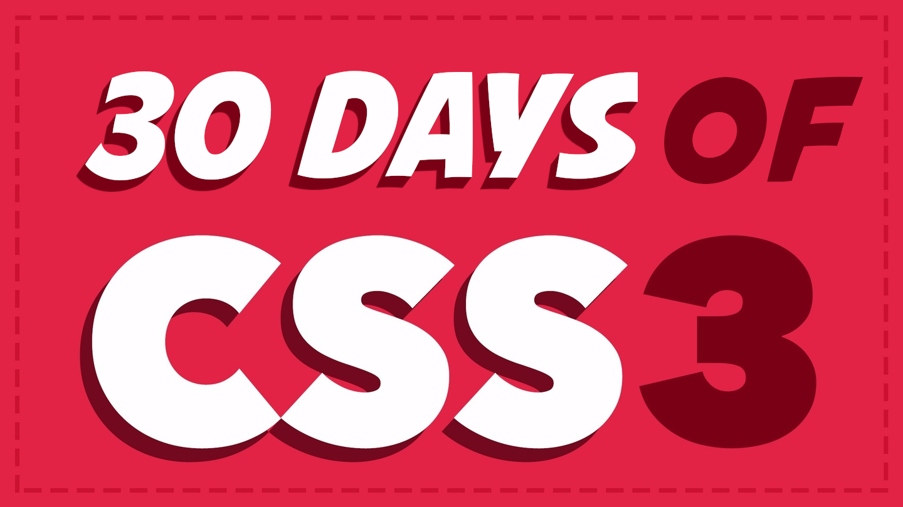

While the Corona is happening, I'm using the time to boost my coding skills using this 30 days css3 challenge that you can find at https://www.youtube.com/playlist?list=PLWKjhJtqVAbl1AfjiGyYxwpdAPi5v-1OU

I have to thanks my wingman Haris (https://github.com/Haris-Siddiqi/CSS3-30-Days) for doing this course with me!  
(He also did this read me organization)

The course is mainly divided in these categories:  

Design:  
Day 1  - Fancy Buttons  
Day 2  - Sexy Typography  
Day 9  - Modern Layouts  
Day 22 - Flexbox Layouts  

Images:  
Day 3  - Clipping Images  
Day 5  - Useful Broken Images  
Day 7  - Image Manipulation  
Day 26 - 3D Layers  
Day 29 - Blurry Effect  

Features:  
Day 4  - Sexy Registration Form  
Day 10 - Pricing Table  
Day 13 - Sticky Footer  
Day 14 - Sticky Header  
Day 15 - Sticky Sidebar  
Day 16 - Modal Window  
Day 18 - Tooltips  
Day 23 - CSS3 Accordion  
Day 25 - Sliding Panels  
Day 27 - Dropdown Menu  

Animations:  
Day 8  - 8-bit Mario  
Day 17 - Pacman  
Day 19 - Animated Progress Bars  
Day 20 - Animated Pyramid  
Day 21 - Spinners  
Day 30 - CSS3 Coffee  

Extras:  
Day 6  - Print Styles  
Day 11 - IE Hacks  
Day 12 - CSS Variables  
Day 28 - Optimizing CSS  

# CSS3 in 30 Days @bradhussey Course

This course had you do one CSS3 topic per day.

The course can be found here on [https://codecollege.ca](https://codecollege.ca/courses).
